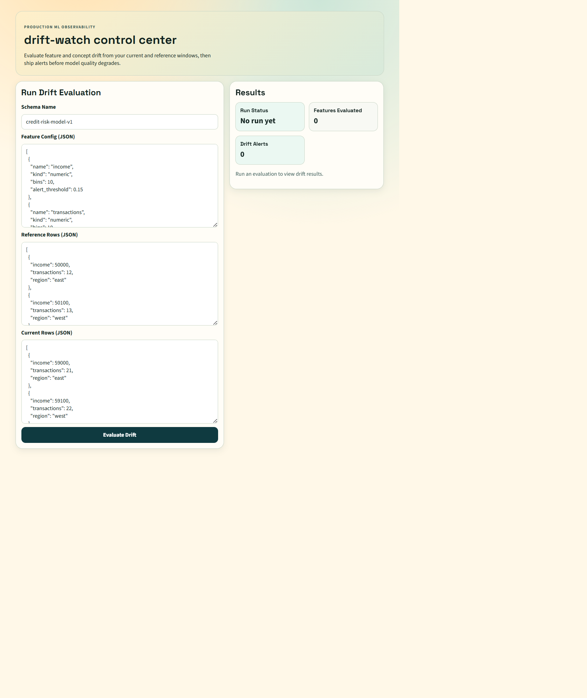

# drift-watch

Production-grade feature and concept drift observatory for ML systems.

`drift-watch` gives you:
- Drift scoring for numeric and categorical features
- Concept drift checks for labels and model residual behavior
- API-first backend for automation
- React dashboard for fast triage
- Docker and GitHub Actions pipelines for deployment

## UI Preview



## Why This Exists

Most teams discover drift only after business impact appears. `drift-watch` is designed for early detection with explicit scoring and reproducible checks.

## Core Capabilities

- Numeric feature drift: PSI + KS statistic
- Categorical feature drift: Jensen-Shannon divergence
- Concept drift: target distribution drift and optional residual shift checks
- JSON schema-driven evaluation requests
- Lightweight deployment path (Docker Compose, GHCR-ready workflows)

## Quick Start (Local)

1. Copy environment file:

```bash
cp .env.example .env
```

2. Start API and dashboard:

```bash
docker compose up --build
```

3. Open:
- Dashboard: http://localhost:8080
- API docs: http://localhost:8000/docs
- Health: http://localhost:8000/health

## Example API Request

```json
{
  "schema_name": "credit-risk-model-v1",
  "features": [
    { "name": "income", "kind": "numeric", "bins": 10, "alert_threshold": 0.2 },
    { "name": "region", "kind": "categorical", "alert_threshold": 0.15 }
  ],
  "reference_rows": [
    { "income": 72000, "region": "east" },
    { "income": 68000, "region": "west" }
  ],
  "current_rows": [
    { "income": 59000, "region": "east" },
    { "income": 61000, "region": "south" }
  ]
}
```

## Production Deployment Targets

- GitHub Container Registry (images)
- Any container platform (ECS, Cloud Run, AKS, Render, Railway)
- Optional GitHub Pages deployment for static dashboard showcase

See `docs/DEPLOYMENT.md` for deployment paths.

## Security and Reliability Defaults

- Request payload size guard
- Trusted host validation
- Configurable CORS allowlist
- Optional HSTS in production
- Readiness and liveness endpoints

## Repository Structure

```text
drift-watch/
  backend/                FastAPI API and drift engine
  frontend/               React dashboard (Vite)
  docs/                   API, deployment, operations docs
  .github/workflows/      CI, release, pages workflows
  docker-compose.yml      Local full stack
  docker-compose.prod.yml Production-oriented compose profile
```

## Current Status

- v0.1.0 baseline: production-ready foundation
- Next: stream ingestion connectors, alert routing integrations, and model registry plugins
